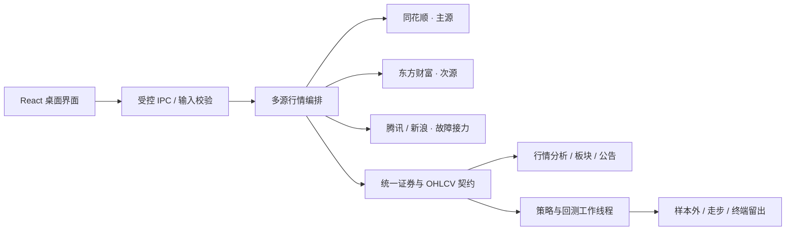

<div align="center">
  

  <h1>A-Share Quant Radar</h1>

  <p><strong>A股雷达 · 面向 A 股研究的多源行情、策略信号与可审计回测桌面工作台</strong></p>
  <p>从涨停生态到个股结构，从公告资讯到策略验证，把分散的研究流程收进一个 Windows 应用。</p>

  <p>
    <a href="https://github.com/tlyer666666/a-stock-radar-tader/releases/latest"></a>
    
    
    
    
    <a href="https://github.com/tlyer666666/a-stock-radar-tader/actions/workflows/qa.yml"></a>
  </p>

  <p>
    <a href="https://github.com/tlyer666666/a-stock-radar-tader/releases/latest">下载最新版</a> ·
    <a href="#-核心能力">核心能力</a> ·
    <a href="#-界面导览">界面导览</a> ·
    <a href="#-回测方法">回测方法</a> ·
    <a href="#-技术架构">技术架构</a> ·
    <a href="#-开发与构建">开发与构建</a>
  </p>

  <p><strong>简体中文</strong> · <a href="README_EN.md">English</a></p>
</div>

---

## 项目定位

**A-Share Quant Radar（A股雷达）** 是一套本地优先的 Windows 桌面研究软件。它以涨停后 T+1 至 T+10 观察为核心，同时覆盖任意非 ST A 股、场内 ETF 与可转债的主动检索和行情分析。

项目强调三件事：

- **数据源有主次与回退**：同花顺作为主源，东方财富作为次源，并保留腾讯、新浪等公开通道用于校验和故障接力。
- **策略结果可追溯**：18 套预定义策略保留规则、样本、基准、样本外和走步验证证据，证据不足时只诊断、不发布。
- **回测不伪造成交**：按主市场交易日、次日可交易性、历史 OHLCV、自定义限价触达和交易成本进行回放。

> [!IMPORTANT]
> 本项目用于行情研究、策略验证与模拟记录，不构成投资建议，不提供收益保证，也不执行真实证券交易。

## ✨ 核心能力

| 模块 | 能力 |
| --- | --- |
| **涨停监控** | 最近交易日涨停池、连板高度、封板质量、开板次数、成交额、换手率与 T+1 至 T+10 观察节点 |
| **个股分析** | 实时报价、多周期 K 线、MA/BOLL/VOL/MACD/KDJ/RSI、量价结构、支撑阻力与 MRS 主线共振评分 |
| **策略信号** | 14 套基础策略 + 4 套固定组合策略；独立样本外、走步窗口、基准超额和终端留出审计 |
| **单股回测** | 可选择一套或多套策略、设置同日最低命中票数、指定股票与开始日期，并支持自定义买入价 |
| **组合回测** | 最多 30 只股票的共享现金账户回放，保留容量、手数、现金复用、逐笔交易与每股贡献约束 |
| **专业复盘** | 八维市场状态、20 因子个股诊断、数据完整度、失效边界、关键价位和次日情景推演 |
| **板块研究** | 行业/概念搜索、板块涨停梯队、晋级率、炸板率、量能热度、内部广度与集中度诊断 |
| **资讯与公告** | 财联社、电报快讯、A 股公司公告与可选同花顺公告，支持去重、时效、方向和风险分级 |
| **本地工作区** | 自选、持仓、观察池、模拟交易、回测历史、设置和 last-good 恢复副本均保存在本机 |

### 多市场标的

- A 股：完整监控、分析、策略与回测入口。
- 场内 ETF / 可转债：支持搜索、实时报价和多周期 K 线；默认不混入涨停池或 A 股策略信号。
- ST、`*ST` 与退市风险股：从自动监控和策略候选中剔除。

### K 线与研究视图

- 1 / 5 / 15 / 30 / 60 / 120 分钟及日、周、月周期。
- 前复权 / 不复权切换、历史窗口拖动、悬停十字线与 OHLCV 明细。
- MA5/10/20/60、BOLL、VOL、MACD、KDJ、RSI 自由组合。
- 多股同列最多并排比较 6 只股票，避免来回切页丢失上下文。

## 📸 界面导览

> 截图使用项目内置预览数据，仅用于展示界面，不代表实时行情或策略收益。

| 市场工作台 | 多策略单股回测 |
| :---: | :---: |
|  |  |
| 涨停生态、个股结构与多源状态 | 多策略投票、单股、日期与自定义买入价 |

## 🧠 策略与验证

策略信号页提供 **18 套可审计规则**：14 套基础策略与 4 套组合共振策略。全市场验证最多使用 300 只涨停观察域证券，并额外加入分层宽基样本；每只股票最多回放 720 根不复权日线，并以中证全指作为基准。

发布门槛由后端固定，前端不能放宽：

- 总样本不少于 120，样本外不少于 36，独立信号日不少于 60。
- 至少 4 个连续走步窗口，通过率不低于 2/3。
- 样本外超额收益与平均收益 95% 单侧下限必须为正。
- 缺少真实 K 线、完整基准或可交易性证据时，只保留诊断结果。
- 终端留出数据不参与策略选择，用于最后独立检验。

## 📈 回测方法

### 单股回测

1. 选择一套或多套策略。
2. 多策略时设置同一交易日的最低命中票数；`1` 表示任一策略命中即可形成组合信号。
3. 选择一只股票和开始日期。
4. 可留空买入价，按信号后下一主市场交易日开盘回放；也可输入自定义价格。
5. 自定义价格只有落在下一交易日真实最低价与最高价区间内才视为成交，未触达不会虚构收益。
6. 结果同时展示组合收益、每套策略独立收益、逐笔交易、胜率、最大回撤和被拒绝原因。

### 组合回测

- 使用共享现金账户，不把各股票收益简单平均。
- A 股按 100 股一手约束，考虑最大持仓数、单股仓位和可用现金。
- 当日退出所得从下一交易日才可复用，避免未来资金提前参与开仓。
- 结果固定标注为“组合诊断”，并披露候选池与幸存者偏差边界。

### 成本与限制

默认回放固定持有 5 个交易日并扣除简化的双边佣金与滑点。当前模型尚未完整覆盖历史税费变化和最低佣金，因此结果适合策略研究，不应直接当作实盘收益。

## 🔄 数据源与容错



- 同花顺有效时优先使用；东方财富补充行业、成交额、市值、封板字段和遗漏标的。
- 主源未配置、超时、无权限或返回无效结构时，自动接力到免费行情通道。
- 数据源状态会保留在结果中，不把缺失值伪装成零。
- 同一分源的并发请求复用在途任务，减少重复访问和限流压力。

## 🏗️ 技术架构

| 层级 | 技术与职责 |
| --- | --- |
| Renderer | React 18、TypeScript、Vite；桌面工作区与交互视图 |
| Desktop | Electron 43；单实例、窗口控制、系统主题和安全 IPC |
| Services | Node.js 服务层；证券规范化、多源编排、缓存、公告和行情聚合 |
| Compute | 独立工作线程；策略特征、历史回放、组合账户与验证统计 |
| Persistence | 原子 JSON 写入、last-good 副本、敏感令牌 `safeStorage` 加密 |
| Quality | TypeScript 类型检查、Node 测试、构建清单和 SHA-256 逐文件校验 |

## 🚀 使用方式

### Windows 正式版

当前仓库以源码为主，正式运行目录由本地构建生成，不把大型二进制文件提交到 Git。构建完成后运行：

```text
程序/A股雷达.exe
```

### 可选同花顺增强

软件默认可通过公开通道工作。若需要同花顺 QuantAPI 增强，可在“数据源设置”中填写 refresh token。令牌通过 Electron `safeStorage` 加密，只保存在本机用户数据目录，不进入源码仓库。

## 🛠️ 开发与构建

### 环境要求

- Windows 10 / 11
- Node.js 24
- pnpm 11.16.0

### 本地开发

```powershell
pnpm install --frozen-lockfile
pnpm dev
```

### 无窗口质量检查

```powershell
pnpm typecheck
pnpm typecheck:review
pnpm test
pnpm build:web
pnpm build:review
```

### 构建 Windows 便携版

```powershell
pnpm build
```

完整运行目录生成在 `release/win-unpacked`。部署到日常使用目录：

```powershell
pnpm build:deploy
```

构建与部署采用暂存目录、逐文件 SHA-256 清单和原子替换；发布新版本时会清理旧的临时产物与多余旧文件，同时尽量保留最后一个完整可恢复版本。

## ✅ 质量保障

- GitHub Actions 在 Windows 上执行锁定依赖安装、关键漏洞审计、双入口类型检查、155 项无网络依赖测试和正式构建。
- 行情、历史 K 线、公告、策略回放、组合账户、敏感数据、持久化与部署均有契约测试。
- 前后端 IPC 只接受当前主窗口主 frame，并对外部 URL、证券标识和设置覆盖做白名单校验。
- `.env`、用户数据、备份、缓存、构建产物和正式 EXE 均通过 `.gitignore` 排除。

## 🗺️ 路线图

- [x] GitHub Releases 便携版下载页
- [ ] 更完整的历史税费与最低佣金模型
- [ ] 回测结果的可分享静态报告
- [ ] 更丰富的公告筛选和公司事件时间轴
- [ ] 持续扩展策略验证覆盖，但保持严格样本外门槛

## 🤝 贡献与反馈

欢迎通过 [Issues](https://github.com/tlyer666666/a-stock-radar-tader/issues) 提交问题。请附上：版本号、股票代码、发生时间、所在模块、操作步骤和脱敏后的错误信息。不要上传行情账户令牌、个人持仓或其他敏感数据。

## ⚠️ 风险声明

证券市场存在显著风险。软件中的评分、策略、回测、资讯方向和模拟交易均可能错误或失效；历史表现不代表未来结果。任何交易决策、资金损失和数据源服务条款责任均由使用者自行承担。

---

<div align="center">
  <sub>Built for auditable A-share research · A-Share Quant Radar</sub>
</div>
