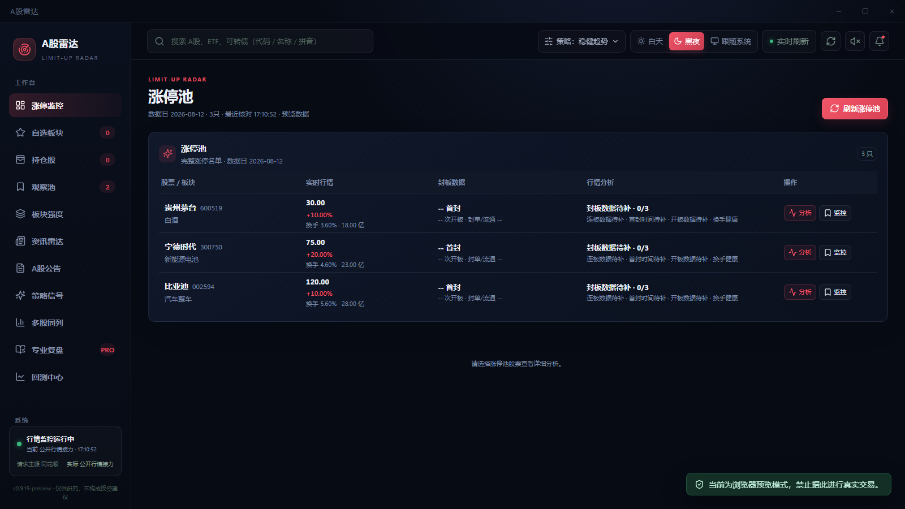
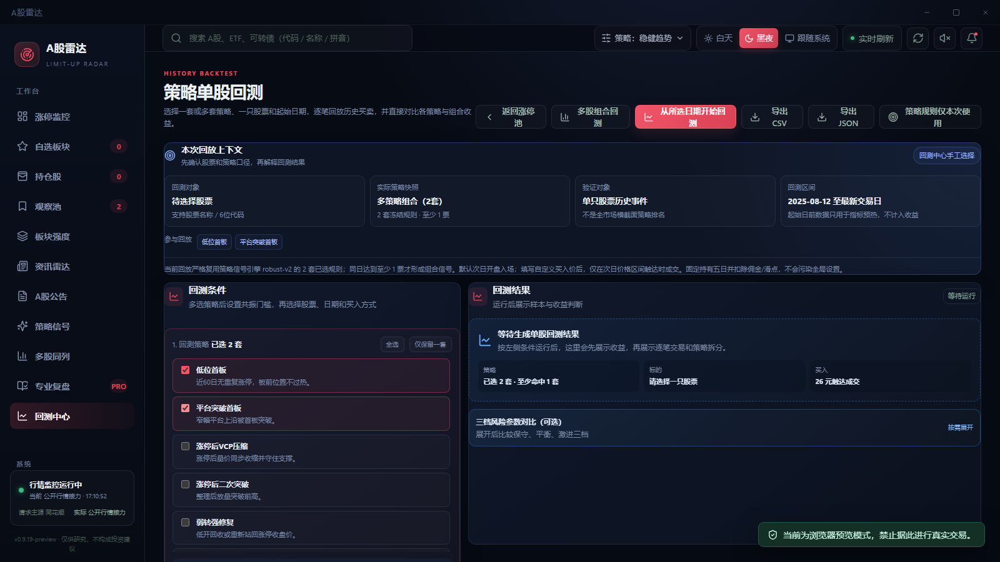
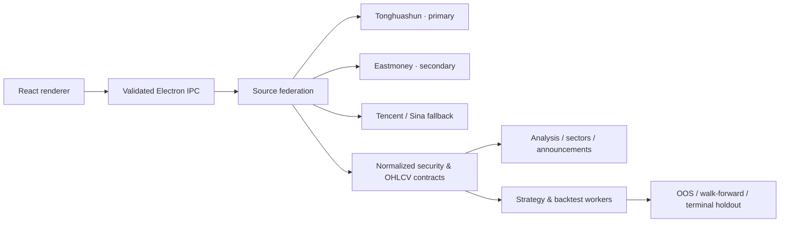

<div align="center">
  

  <h1>A-Share Quant Radar</h1>
  <p><strong>A multi-source market, strategy-signal, and auditable backtesting desktop workspace for China's A-share market.</strong></p>

  <p>
    <a href="https://github.com/tlyer666666/a-stock-radar-tader/releases/latest"></a>
    
    
    
    <a href="https://github.com/tlyer666666/a-stock-radar-tader/actions/workflows/qa.yml"></a>
  </p>

  <p><a href="https://github.com/tlyer666666/a-stock-radar-tader/releases/latest">Download latest</a></p>
  <p><a href="README.md">简体中文</a> · <strong>English</strong></p>
</div>

---

## Overview

**A-Share Quant Radar** is a local-first Windows desktop research application centered on limit-up market structure, post-event observation, stock analysis, strategy validation, announcements, and historical replay.

Its design priorities are:

- **Explicit source priority and failover** — Tonghuashun is the primary source and Eastmoney is secondary, with public Tencent and Sina routes used for validation and recovery.
- **Auditable strategy evidence** — 18 predefined strategies retain rule, sample, benchmark, out-of-sample, walk-forward, and terminal-holdout evidence.
- **No fabricated fills** — replay respects the master-market calendar, next-day tradability, historical OHLCV, custom limit-price reachability, and simplified trading costs.

> [!IMPORTANT]
> This project is for market research, strategy validation, and paper records only. It is not investment advice, does not guarantee returns, and does not execute real securities trades.

## Key Features

| Area | Capabilities |
| --- | --- |
| Limit-up monitoring | Latest trading-day pool, consecutive-board height, seal quality, break count, turnover, and T+1 through T+10 observation nodes |
| Stock analysis | Live quotes, multi-timeframe candlesticks, technical overlays, price-volume structure, key levels, and MRS scoring |
| Strategy signals | 14 base strategies and 4 fixed composite strategies with out-of-sample and walk-forward evidence |
| Single-stock replay | One or multiple strategies, same-day vote threshold, stock, start date, and optional custom entry price |
| Portfolio replay | Shared-cash replay for up to 30 stocks with capacity, board-lot, cash reuse, ledger, and contribution constraints |
| Professional review | Eight market dimensions, 20 stock factors, data completeness, invalidation boundaries, and next-session scenarios |
| Sectors and events | Industry/concept research, sector ladders, internal breadth, news, and A-share company announcements |
| Local workspace | Watchlists, holdings, observation pool, paper trades, replay history, settings, and last-good recovery copies |

## Screenshots

> Screenshots use built-in preview data for UI demonstration only. They are not live market data or strategy performance.

| Market workspace | Multi-strategy single-stock replay |
| :---: | :---: |
|  |  |

## Backtesting Integrity

- A signal enters at the next master-market trading-day open by default.
- A custom entry price fills only if it falls inside that day's actual low-high range.
- One-price limit-up and non-tradable sessions are rejected instead of being counted as profits.
- Portfolio replay uses one shared cash account and A-share board lots; same-day exit proceeds become reusable only on the next session.
- Simplified round-trip commission and slippage are deducted. Historical tax changes and minimum commissions are not yet fully modeled.
- Strategy publication gates are backend-enforced and cannot be relaxed by the renderer.

## Architecture



| Layer | Stack and responsibility |
| --- | --- |
| Renderer | React 18, TypeScript, Vite |
| Desktop | Electron 43, single-instance lifecycle, secure IPC |
| Services | Node.js source federation, normalization, caching, quotes, and announcements |
| Compute | Worker-thread strategy features, historical replay, portfolio accounting, and validation |
| Persistence | Atomic JSON writes, last-good recovery, Electron `safeStorage` for sensitive tokens |
| Quality | Type checks, Node tests, build manifests, and per-file SHA-256 verification |

## Development

Requirements: Windows 10/11, Node.js 24, and pnpm 11.16.0.

```powershell
pnpm install --frozen-lockfile
pnpm dev
```

Headless checks:

```powershell
pnpm typecheck
pnpm typecheck:review
pnpm test
pnpm build:web
pnpm build:review
```

Build the Windows portable tree:

```powershell
pnpm build
```

Deploy the verified build to the formal local program directory:

```powershell
pnpm build:deploy
```

## Security and Privacy

- API tokens are encrypted with Electron `safeStorage` and remain in the local user-data directory.
- `.env` files, user data, backups, caches, build outputs, and executable bundles are excluded from Git.
- Renderer IPC calls are restricted to the active main window and validated against explicit contracts.
- External links and security identifiers are canonicalized and checked before service use.

## Roadmap

- [x] Portable downloads through GitHub Releases
- [ ] More complete historical tax and minimum-commission modeling
- [ ] Shareable static backtest reports
- [ ] Richer announcement filters and corporate-event timelines
- [ ] Broader strategy coverage while preserving strict out-of-sample gates

## Feedback

Use [GitHub Issues](https://github.com/tlyer666666/a-stock-radar-tader/issues) and include the version, security code, timestamp, module, reproduction steps, and sanitized error information. Never upload market-account tokens, personal holdings, or other sensitive data.

## Disclaimer

Securities markets involve substantial risk. Scores, strategies, replays, news classifications, and paper-trading outputs can all be wrong or become invalid. Historical results do not imply future performance. Users are solely responsible for trading decisions, losses, and compliance with data-provider terms.
